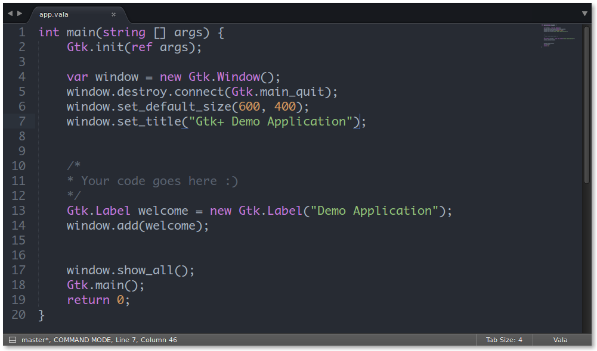

# Vala Devbook

This book will help you learn the `Vala` programming language popularly used for `Gtk+` GUI development. It is **NOT* meant as a resource for learning computer programming as a complete beginner. It is written to help you use your existing programming knowledge to learn Vala for GTK+ GUI applications. 

> If you are new to computer programming, see [Learn Coding](https://github.com/aberba/learn-coding), a book for absolute beginners to learn computer programming. 

> See also the [elementary OS Devbook](https://github.com/aberba/elementaryOS-devbook) to learn how to develop applications for [elementary OS](https://elementary.io) using Vala. 

## Contents

* Chapter One: The Basics
    - [x] Setting up your development environment.
...

* Chapter Three: Using Gtk+
    - [ ] Initial demo application
    - [ ] Exploring Gtk widgets
    - [ ] Gtk signals